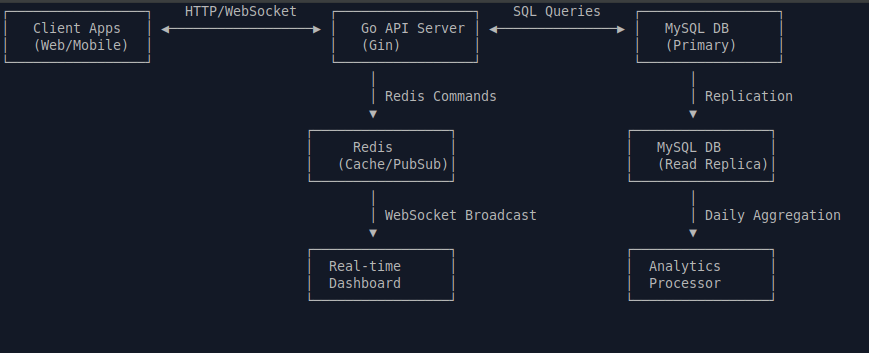

# User Activity Tracking System

A high-performance backend system for tracking user API usage with Redis caching, MySQL database, and comprehensive security.

## Features

✅ **Complete Implementation** of all core requirements and bonus challenges:
- RESTful API with 4 endpoints
- Redis caching with Pub/Sub and prefetch mechanism
- MySQL with partitioning, sharding, and replication
- JWT authentication & rate limiting
- WebSocket real-time updates
- Docker support with docker-compose
- Swagger/OpenAPI documentation
- Concurrency handling & fault tolerance

System Architecture




## Quick Start

### Using Docker (Recommended)

```bash
# 1. Clone and setup
git clone https://github.com/iratdyawinggari/user-activity-tracker.git
cd user-activity-tracker
cp .env.example .env

# 2. Start services
docker-compose up -d

# 3. Initialize database
docker exec -i activity-mysql mysql -uroot -prootpassword < migrations/01_init_schema.sql

# 4. Verify
curl http://localhost:8080/health
# Should return: {"status":"healthy","services":{"database":"connected","redis":"connected"}}

API Documentation

    Swagger UI: http://localhost:8080/swagger/index.html

    Health Check: http://localhost:8080/health

API Endpoints
Public Endpoints

    POST /api/register - Register new client (returns API key & JWT token)

    GET /health - System health check

Protected Endpoints (require authentication)

    POST /api/logs - Record API hit

    GET /api/usage/daily - Daily usage for last 7 days

    GET /api/usage/top - Top 3 clients in last 24 hours

Real-time Endpoint

    GET /ws - WebSocket connection for real-time updates

Authentication Methods
1. API Key Authentication
bash

curl -H "X-API-Key: your-api-key" http://localhost:8080/api/usage/daily

2. JWT Token Authentication
bash

curl -H "Authorization: Bearer your-jwt-token" http://localhost:8080/api/usage/daily

Get Credentials
bash

# Register to get API key and JWT token
curl -X POST http://localhost:8080/api/register \
  -H "Content-Type: application/json" \
  -d '{"name":"MyApp","email":"app@example.com"}'

# Response includes: client_id, api_key, token

Testing
Automated Test
bash

# Run test script
chmod +x test_api.sh
./test_api.sh

Manual Testing
bash

# 1. Register client
curl -X POST http://localhost:8080/api/register \
  -H "Content-Type: application/json" \
  -d '{"name":"Test","email":"test@example.com"}'

# 2. Record API hits (use API key from step 1)
curl -X POST http://localhost:8080/api/logs \
  -H "Content-Type: application/json" \
  -H "X-API-Key: YOUR_API_KEY" \
  -d '{"endpoint":"/api/users"}'

# 3. Check daily usage
curl -X GET "http://localhost:8080/api/usage/daily" \
  -H "X-API-Key: YOUR_API_KEY"

# 4. Check top clients
curl -X GET "http://localhost:8080/api/usage/top" \
  -H "X-API-Key: YOUR_API_KEY"

Real-time WebSocket Updates
bash

# Install wscat
npm install -g wscat

# Connect to WebSocket
wscat -c ws://localhost:8080/ws

# Send subscribe message
{"type": "subscribe"}

# Now make API calls in another terminal
# WebSocket will receive real-time updates

Development
Without Docker
bash

# Install dependencies
go mod download

# Install Swagger CLI (optional)
go install github.com/swaggo/swag/cmd/swag@latest

# Build and run
make build
make run

# Or run directly
go run ./cmd/webserver

Makefile Commands
bash

make all          # Build everything
make run          # Run application
make test         # Run tests
make docker-up    # Start Docker services
make docker-down  # Stop Docker services
make swagger      # Generate Swagger docs
make migrate      # Run database migrations

Project Structure

user-activity-tracker/
├── cmd/
│   └── webserver/
│       └── main.go                 # Application entry point
├── configs/
│   └── config.go                   # Configuration management
├── internal/                       # Internal application packages
│   ├── cache/
│   │   └── redis_cache.go          # Redis cache with fallback
│   ├── database/
│   │   └── database.go             # Database connection & sharding
│   ├── handlers/
│   │   ├── client_handler.go       # API request handlers
│   │   └── websocket_handler.go    # WebSocket handler
│   ├── middleware/
│   │   └── auth_middleware.go      # Auth & rate limiting middleware
│   ├── models/
│   │   └── models.go               # Database models
│   └── services/
│       └── auth_service.go         # Authentication service
├── migrations/
│   └── 01_init_schema.sql          # Database schema
├── docs/                           # Swagger documentation
├── docker-compose.yml              # Docker services
├── Dockerfile                      # Application Dockerfile
├── Makefile                        # Build commands
├── README.md                       # This file
├── .env.example                    # Environment template
├── test_api.sh                     # API test script
└── load_test.go                    # Load test

Environment Variables

Create .env file from .env.example:
env

SERVER_PORT=8080
DATABASE_URL=user:password@tcp(mysql:3306)/activity_tracker
REDIS_URL=redis:6379
JWT_SECRET=your-secret-key-change-this
RATE_LIMIT_PER_HOUR=1000
CACHE_TTL=1h
ENABLE_WEBSOCKET=true

Key Features Implemented
🚀 Performance

    Redis caching with 1-hour TTL

    Connection pooling (100 concurrent connections)

    Atomic Redis INCRBY operations

    Read/write database separation

🔒 Security

    JWT token authentication

    API key validation with bcrypt

    Rate limiting (1000 requests/hour)

    SQL injection protection

    AES data encryption

📊 Database

    MySQL 8.0 with partitioning by date

    Horizontal sharding strategy

    Automated daily aggregation

    Optimized indexes

🔄 Real-time

    WebSocket connections

    Redis Pub/Sub for notifications

    Cache invalidation on updates

🐳 Containerization

    Docker for all services

    docker-compose for orchestration

    Health checks and monitoring